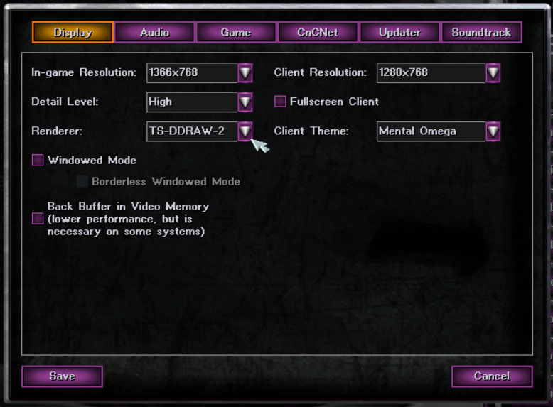


# 
It started off as a balance modification created by Speeder and Mevitar and first released in 2005. After a few years, it had grown into an unofficial sequel with new campaigns for the Allies, Soviets, and Yuri. Version 3.3 marks the end of the long road and the final release in the Mental Omega series.

The original game is needed to be able to play this MOD.

## [Info](http://mentalomega.com/index.php?page=install)
The files required for Mental Omega 3.3 to function are:

Note: Prepare files from Red Alert 2 Yuri's Revenge 1.001
- BINKW32.dll
- BLOWFISH.dll
- gamemd.exe (patched to version 1.001)
- ra2.mix
- ra2md.mix
- language.mix
- langmd.mix

## [Install](http://mentalomega.com/index.php?page=install)
Mod is installed in: `%localappdata%\programs\mentalomega`

Follow original instructions from: http://mentalomega.com/index.php?page=install

## Configuration
In order for the mod to function properly, in some cases the following in-game setting is required:
* Renderer: TS-DDRAW-2

